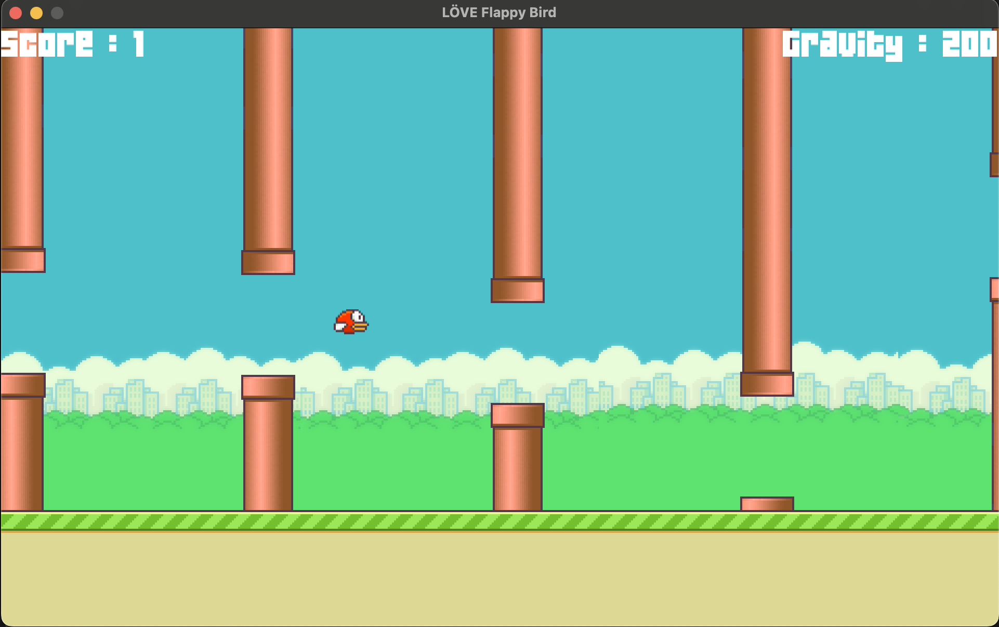

# LÖVE Flappy Bird
Flappy Bird is a mobile game developed by Vietnamese video game artist and programmer __*Dong Nguyen*__. The game is a side-scroller where the player controls a bird, attempting to fly between columns of red pipes without hitting them.

## Screenshots

## Controls
| Key / Button   | Action |
| -------- | ------- |
| up arrow, left mouse, space  | push bird    |

## Addons
* [LÖVE](https://love2d.org) framework official website
* [Input library](https://github.com/a327ex/boipushy)
* [Anim8](https://github.com/kikito/anim8)
* [yt](https://youtu.be/LwAtwLZfe3Y?feature=shared) - gameplay
